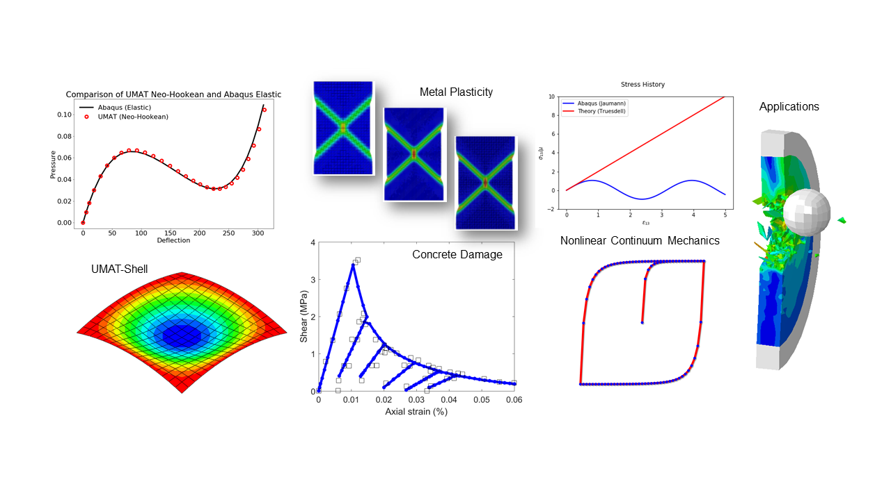

# Advanced Computational Science and Engineering

## Introduction

We create high-quality code for computational mechanics. We focus on the development of robust finite element subroutines (e.g., Abaqus UMATs, UELs).

Black-box solutions or commercial software provide only functionality, while the source code is hidden. Open-source solutions provide full access to source code, but 
are typically too complicated or heavy for the beginner developer, researcher or engineer to understand. We take the middle ground approach where 
we provide self-contained code that encapsulates the basic components of finite element technology.

Our development philosophy:
- focus on readibility and understandability of code
- develop essential and important features (e.g., UMAT for shells) 
- focus on fundamental but realistic material response (e.g., finite strain, hyperelastic, elasto-plastic)
- use robust and well-established algorithms
- provide full line-by-line derivations of the formulations used
- software reliability and extensibility
- continous enhancements and bug fixes

Our development work uses Fortran, C, C++, Matlab, Python.

## Current work

### [Finite Element Code](finite-element-code)

### [Python Constitutive Model Driver](python-constitutive-model-driver)

### [Abaqus Subroutines](abaqus-subroutines)

<!---
### UMAT
  * [UMAT 3d finite](umat-3d)
  * [UMAT shell finite](umat-shell)

### UEL
  * [UEL 3d finite](uel-3d)

### Books
  * [Nonlinear Continuum Mechanics Workout](nonlinear-continuum-mechanics-workout)  
  
### [Books](books)  
--->
  
## Contact

For general inquiries, please email: advanced.cse@gmail.com

Our webpage (the one you are looking at right now): [https://advancedCSE.github.io](https://advancedCSE.github.io)

<!---
test1
### Matlab
  * To be announced
  
### Python
  * To be announced
  * UMAT small (to be annouced)
  * UEL small (to be annouced)
-->