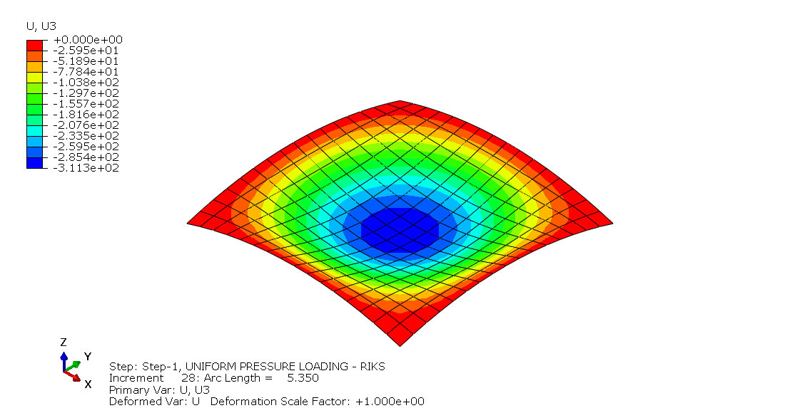
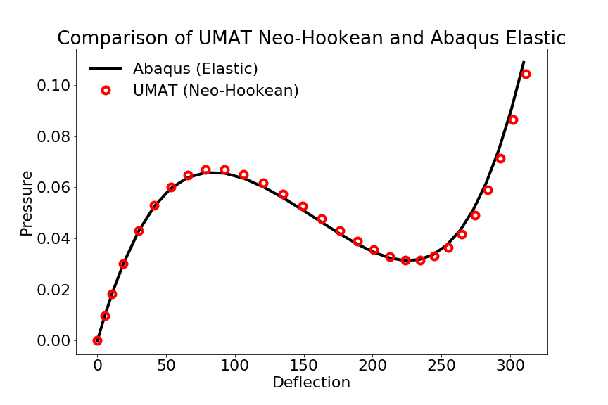

# UMAT Shell Finite

This is a UMAT for finite strain shell response. A full 3D finite strain constitutive model (Neo-Hookean material) is used and an iterative procedure is used to enforce the zero- or plane-stress condition. 

Programming language: C/C++, Fortran implementation to be considered subsequently

Below are the calculation results of the NAFEMS 3DNLG-7 benchmark test of the elastic large deflection response of a hinged spherical shell under pressure loading.

