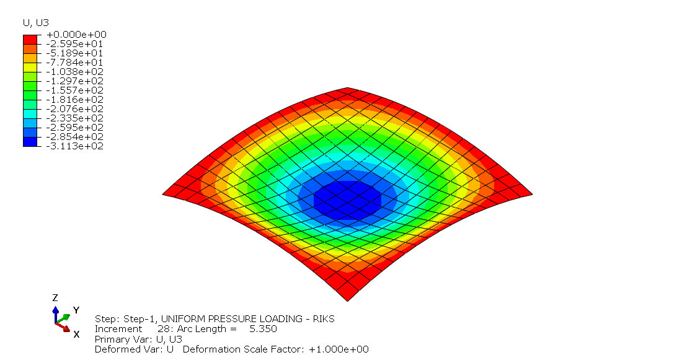
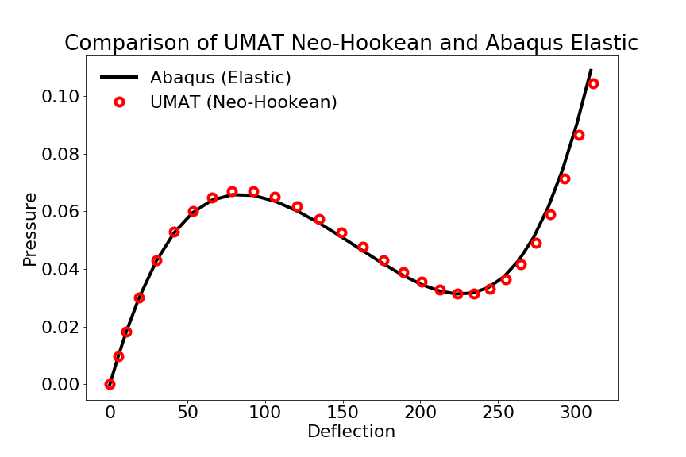

# Abaqus Subroutines

## UMAT Shell Finite

This is a UMAT for finite strain shell response. A full 3D finite strain constitutive model (Neo-Hookean material) is used and an iterative procedure is used to enforce the zero- or plane-stress condition. 

Programming language: C/C++, Fortran implementation to be considered subsequently

Below are the calculation results of the NAFEMS 3DNLG-7 benchmark test of the elastic large deflection response of a hinged spherical shell under pressure loading.

## UMAT 3D Finite

### Umat Simo

This is an Abaqus UMAT for finite strain von Mises elasto-plasticity using the approach described by the late Juan Simo in this paper:

* Simo, Juan C. "Algorithms for static and dynamic multiplicative plasticity that preserve the classical return mapping schemes of the infinitesimal theory." Computer Methods in Applied Mechanics and Engineering 99.1 (1992): 61-112.

Programming language: Fortran

### Umat Miehe

This is an Abaqus UMAT for finite strain von Mises elasto-plasticity using the approach described by the late Christian Miehe in these papers:

* Miehe, Christian and Lambrecht, Matthias . "Algorithms for computation of stresses and elasticity moduli in terms of Seth–Hill's family of generalized strain tensors." Communications in numerical methods in engineering 17.5 (2001): 337-353.

* Miehe, Christian, Apel, Nikolas and Lambrecht, Matthias. "Anisotropic additive plasticity in the logarithmic strain space: modular kinematic formulation and implementation based on incremental minimization principles for standard materials." Computer Methods in Applied Mechanics and Engineering 191.47-48 (2002): 5383-5425.

Programming language: Fortran

## UEL 3D Finite

This is an Abaqus UEL of the F-Bar finite strain element described in this paper:

* de Souza Neto, E. A., Perić, D., Dutko, M., & Owen, D. R. J. (1996). Design of simple low order finite elements for large strain analysis of nearly incompressible solids. International Journal of Solids and Structures, 33(20-22), 3277-3296.

The von Mises plasticity is used as the material model.

Programming language: Fortran

