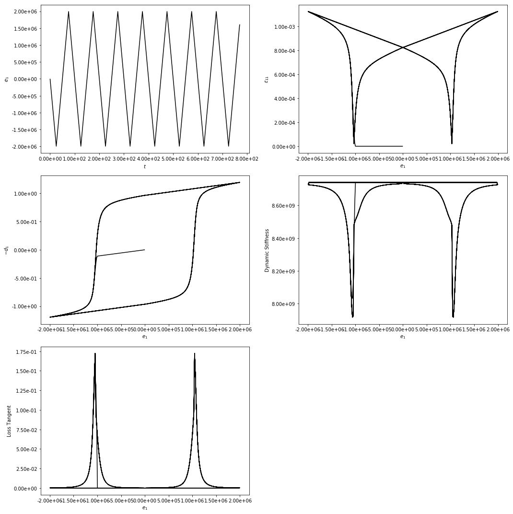

# Finite Element Code

The Python version of code is under development.

The C++ version of code can be found <a href="https://advancedCSE.github.io/finite-element-code/ferro_documentation/html/index.html" title="here">here</a>.

<!---This work was initially motivated by applications of ferro-electric materials. 

More elements, material models and parallel implementation are being considered.

## Finite Elements

* 8-node hexahedron
* 4-node quadrilateral 
* 4-node mixed quadrilateral; 2-field (linear displacement, linear electric potential)
* 9-node mixed quadrilateral; 2-field (quadratic displacement, linear electric potential)

## Material Models

* Linear elasticity
* Piezoelectric
* Ferroelectric

## Robust algorithms

* Variational constitutive update for ferroelectricity

## Ease of use

* Adaptive time stepping - time step cuts back when there is no convergence, increases when there is convergence.

* Abaqus-like input file:

	- *NODE to specify nodes
	- *ELEMENT to specify elements
	- *CLOAD and *BOUNDARY to specify stress and strain boundary conditions, respectively
	- *AMPLITUDE keyword to specify time-varying amplitude functions

## Examples

An example of the extraction of incremental viscoelastic response is illustrated in the figures below. Here, these quantities are the loss tangent and dynamic stiffness due to small-amplitude, high-frequency mechanical loading for the inelastic hysteretic behavior under large-amplitude, low-frequency electric field loading. 

## Documentation

Class documentation can be found <a href="https://advancedCSE.github.io/finite-element-code/ferro_documentation/html/index.html" title="here">here</a>
--->